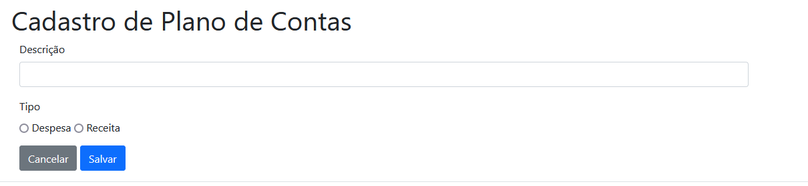
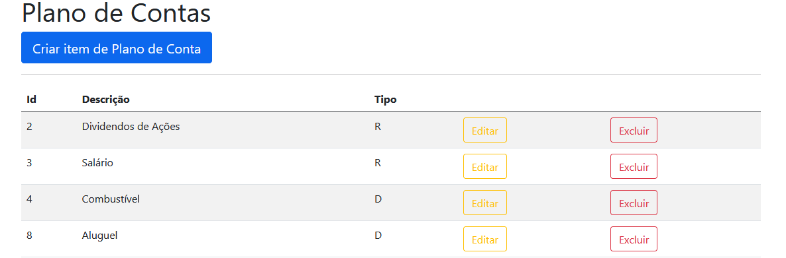
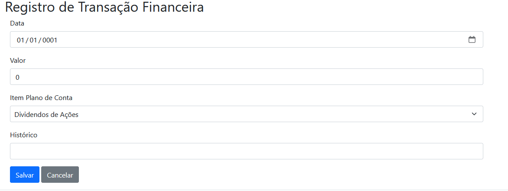
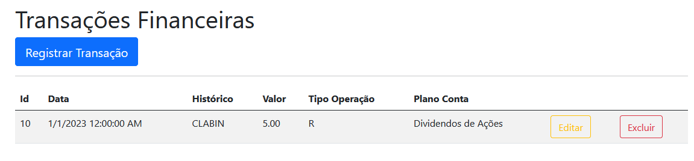
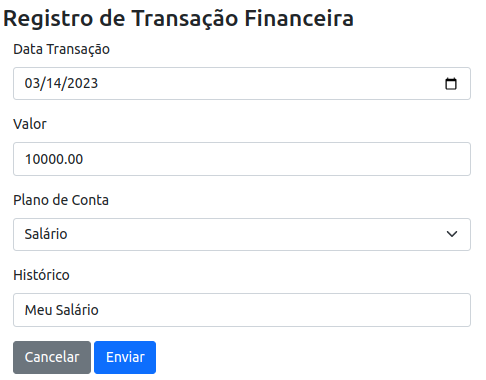
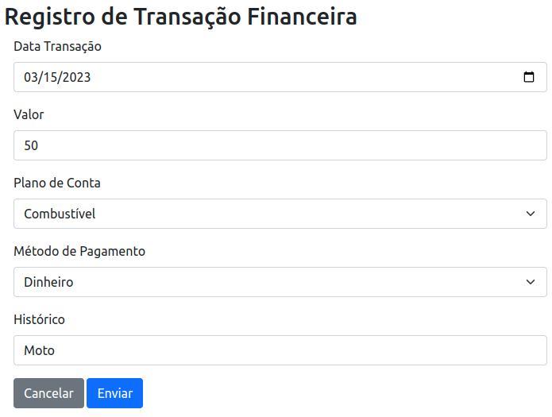

# myfinance-web-dotnet

MyFinance - Projeto do Curso de Pós-Graduação em Engenharia de Software da PUC-MG. MyFinance é um sitema para registro de receitas e despesas do usuário.

## Tecnologias

O projeto contempla as seguintes tecnologias:

- ASP .NET
- SQL

## Comandos da aplicação

obs: Antes de executar os comandos para rodar a aplicação, deve fazer o caminho até a pasta 'myfinance-web-dotnet':

`cd src/myfinance-web-dotnet`

Comando para rodar o build da aplicação:

`dotnet build`

Comando simples para rodar aplicação:
`dotnet run`

Comando para rodar a aplicação e não precisar reinicializar após alterações:

`dotnet watch run`

## DER - Diagrama Entidade Relacionamento


## Visão geral do sistema

### Tela de Plano de contas

Nessa Tela o usuário pode criar, editar, excluir e ver plano de contas.



### Tela de Transações

Nessa Tela o usuário pode criar, editar, excluir e ver transações.



## Feature Extra: Implementar método de pagamento quando a transação for despesa

### Passo a Passo

- Criar a tabela no banco de dados metodopagamento com as colunas Id e Tipo:

  ```sql
    create table metodopagamento(
      id int identity(1,1) not null,
      tipo varchar(50) not null,
    );
  ```

- Popular tabela metodopagamento com os tipos de pagamento: Crédito, débido, pix, boleto, Dinheiro:

  ```sql
    insert into metodopagamento
      (tipo)
      values
        ('Dinheiro'),
        ('Crédito'),
        ('Débito'),
        ('Pix'),
        ('Boleto'),
  ```

- Criar uma FK na tabela Transacao apontando para metodoPagamento(Id):

  ```sql
    ALTER TABLE transacao
    ADD metodopagamentoid INT
    REFERENCES metodopagamento(id);
  ```

- Criar model e entidade de MetodoPagamento
- Adicionar contexto de MetodoPagamento na configuração de banco de dados da aplicação:

  ```c#
    public DbSet<MetodoPagamento> MetodoPagamento { get; internal set; }
  ```

- Criar Interface de serviço IMetodoPagamento;
- Criar Servico de MetodoPagamento;
- Adicionar serviço no arquivo Program.cs:

  ```c#
    builder.Services.AddScoped<IMetodoPagamentoService, MetodoPagamentoService>();
  ```

- Atualizar serviço de transação:
  - Fazer include de MetodoPagamento no método ListarTransacoes no contexto que retorna lista
  - Adicionar objeto MetodoPagamento no objeto ItemTransacao no foreach do método ListarTransacoes
  - Adicionar MetodoPagamento Id no itemTransacao dos métodos RetornarTransacao e Salvar
- Atualizar controller de transação:
  - Fazer injeção de dependencia de serviço IMetodoPagamentoService
  - Na rota get de cadastro adicionar variavel listaMetodosPagamento:
    ```c#
      var listaMetodosPagamento = _metodoPagamentoService.ListarMetodos();
    ```
  - Na rota get de cadastro adicionar a model a lista de MetodosPagamento:
  ```c#
    model.MetodosPagamento = new SelectList(listaMetodosPagamento, "Id", "Tipo");
  ```
- Criar nova rota na PlanoController: ObtemTipoPlanoConta/{id} para verificar tipos e realizar condições para mostrar/esconder bloco na tela de cadastro/edição de transação

- Implementar condição na tela de cadastro/edição de cadastro/edição de transação

### Evidências da Feature Extra

_OBS: Na descrição da tarefa mostra radiobuttons para selecionar o tipo de transação ('receita' ou 'despesa'), não achamos necessário mostrar esse campo, já que essa informação é passada no momento de criação do item Plano de contas, então quando o usuário selecionar o plano de contas na criação/edição de transação a aplicação já consegue entender o tipo dessa transação para mostrar ou não o campo método de pagamento._

#### Receita



#### Despesa


