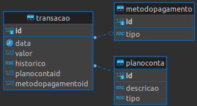

# myfinance-web-dotnet

MyFinance - Projeto do Curso de Pós-Graduação em Engenharia de Software da PUC-MG

## Tecnologias

O projeto contempla as Seguintes tecnologias:

- ASP .NET
- SQL

## Comandos da aplicação

obs: Antes de executar os comandos para rodar a aplicaçãol, deve fazer o caminho até a pasta 'myfinance-web-dotnet':

`cd src/myfinance-web-dotnet`

Comando para rodar o build da aplicação:

`dotnet build`

Comando simples para rodar aplicação:
`dotnet run`

Comando para rodar a aplicação e não precisar reinicializar após alterações:

`dotnet watch run`

Comando para rodar o docker do banco de dados
`docker-compose `

## DER - Diagrama Entidade Relacionamento

##
